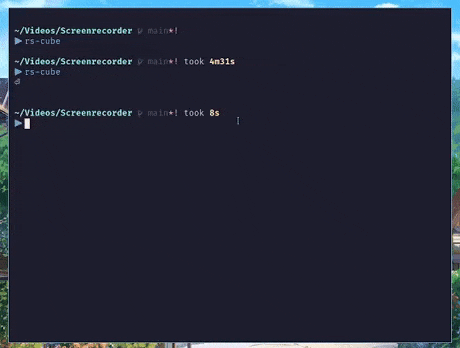

# rs-cube

[](https://crates.io/crates/rs-cube)

Blazingly Fast 3D ASCII Rubik's Cube


## Screenshot



## Installation

### Homebrew

```sh
brew tap doprz/rs-cube
brew install rs-cube
```

### Cargo

```sh
cargo install rs-cube
```

### From Source

To build and install from source, first checkout the tag or branch you want to install, then run
```sh
cargo install --path .
```
This will build and install `rs-cube` in your `~/.cargo/bin`. Make sure that `~/.cargo/bin` is in your `$PATH` variable.

## Usage

```
Blazingly Fast 3D ASCII Rubik's Cube

Usage: rs-cube [OPTIONS]

Options:
  -d, --debug                  Enable debug info
  -f, --fps-limit <FPS_LIMIT>  [default: 60]
  -h, --help                   Print help
  -V, --version                Print version
```

### Unlimited FPS

```sh
rs-cube --fps-limit 0
```

## License

`rs-cube` is dual-licensed under the terms of both the MIT License and the Apache License 2.0

SPDX-License-Identifier: MIT OR Apache-2.0
